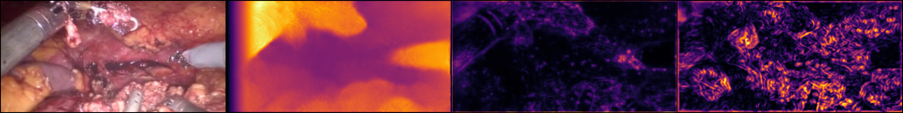

# _Randomly-connected neural networks for self-supervised monocular depth estimation_ Model

This repository holds the code for a refactored version of the model proposed by Sam Tukra and Stamatia Giannarou in [_Randomly-connected neural networks for self-supervised depth estimation_](https://www.tandfonline.com/doi/full/10.1080/21681163.2021.1997648). The package has been adapted from the original repo, but with added configurability of the model architecture, discriminator and loss functions. Furthermore, the package has been designed to parallelise across multiple nodes and GPUs using PyTorch's [`DistributedDataParallel`](something) module.



## Model Description


...

## Pre-requisites and installation

To use this package, you will need Python 3.6 or higher. Using an NVIDIA GPU, such as an RTX6000 is recommended.

Download the repository from GitHub and create a virtual environment and activate it:
```bash
python -m venv venv
. venv/bin/activate
```

Install all the packages from pip
```bash
python -m pip install -r requirements.txt
```

## Usage

To use this code, you can either:
- Run the example scripts
- Run one of the python `main` programs.
- Use the packages directly

### Datasets

There are three datasets currently available with this package:
- CityScapes `leftImg8bit` and `rightImg8bit` datasets.
- Hamlyn da Vinci Dataset.
- SCARED Dataset.

Note, the example scripts and main programs find the datasets by assuming there is a `datasets` folder in your home directory, and within that are datasets named `cityscapes`, `da-vinci` or `scared` respectively. To alter this, you can set the path of the directory it seeks `datasets` from. In the future, this will be replaced with a flag for the complete dataset path.

### Model

Within the `model` package, there is a separate module for the:
- Encoder architecture (`encoder.py`).
- Decoder architecture (`decoder.py`).
- Complete model, i.e. the encoder and decoder (`model.py`).
- Discriminator, when using the `--adversarial` flag in the main program (`discriminator.py`).

There are also a package for all the PyTorch layers used in the model, and a module for creating and loading the graphs used in the randomly-connected encoder architecture.

### Training

Within the `train` package, there are modules for:
- Training and checkpointing the model (`train.py`).
- Evaluating and saving example images of the model (`evaluate.py`).
- The loss functions needed to train the model (`loss.py`).
- The transforms, based on `torchvision.transforms` that are compatible with the datasets.

### Configuration

To create the model, discriminator and loss functions, each class takes in keyword arguments. Therefore, it is possible to unpack a dictionary of the key values into the class constructor.

This is used to create a single configuration file that can pass the dictionaries


## Repository Structure

```bash
graphs/
    nodes_5_seed_42/ # default graphs used in the encoder

loaders/
    __init__.py
    cityscapes.py # CityScapes 8-bit Dataset
    davinci.py # Hamlyn da Vinci Dataset
    scared.py # SCARED Dataset

model/
    __init__.py
    layers/ # layers, blocks and stages used in the model
        attention.py
        decoder.py
        encoder.py
    decoder.py
    discriminator.py # for adversarial training
    encoder.py
    graph.py # for building the graph structure within the encoder
    model.py

scripts/
    finetune_test.sh # example for finetuning model
    local_test.sh # test training without cuda
    macos_setup.sh # set up GPU training with MPS
    package_model.sh # zip model package
    parallel_test.sh # test training the model with DDP
    rcs_parallel_job.rcs # train model using DDP on HPC
    rcs_serial_job.pbs # train model without DDP on HPC
    remove_model.sh # (paperspace only) delete package
    serial_test.sh # example for training model
    slurm_job.sh # train model on SLURM

train/
    __init__.py
    evaluate.py
    loss.py # all loss functions used in training
    train.py
    transforms.py # modified torchvision transforms
    utils.py # useful functions and type hints

.gitignore
config.yml # The config file for building the model, disc and loss
main.py # for training the model without DDP
parallel_main.py # for training the model with DDP
readme.md
requirements.txt # pip packages needed to run the model
results.png
```